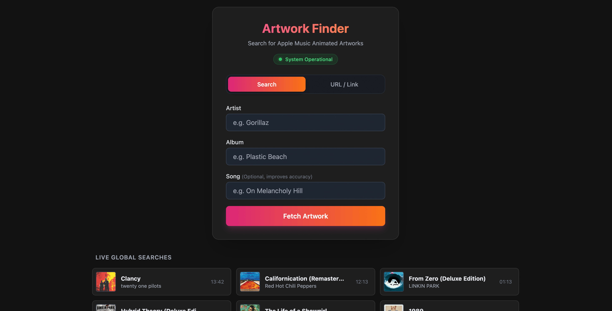

# [](https://artwork.m8tec.top) Apple Music Animated Artworks

[](https://artwork.m8tec.top)
[](https://github.com/m8tec/apple-music-animated-artworks/actions)

<div align="center">



A lightweight tool to fetch and display Apple Music’s animated album covers (HLS/m3u8). Built with .NET 10 and a minimal Tailwind CSS frontend.

**Test it out:** [https://artwork.m8tec.top](https://artwork.m8tec.top)

</div>

## What it does
- Scraping: Pulls the .m3u8 stream URL directly from Apple Music’s public web player using JSON-LD metadata.
- Persistent Cache: Saves results in a local cache_database.json file. It only hits Apple's servers once per album.
- Thread Safety: Uses a keyed locker to prevent multiple concurrent requests for the same album from overloading the backend.
- Web Player: Simple UI using hls.js to play the animated covers in any browser (not just Safari).

## Tech Stack
- Backend: .NET 10 (Minimal APIs, HttpClient, Regex for parsing)
- Frontend: Plain JS, Tailwind CSS, Hls.js
- Storage: Simple JSON-based persistence (In-memory dictionary + file flush)

## 🚀 Getting Started

### Run with Docker
```bash
docker run -d -p 8080:8080 -v ./data:/app/data ghcr.io/m8tec/apple-music-animated-artworks:latest
```

### Run locally (.NET 10 required)
```
git clone [https://github.com/m8tec/apple-music-animated-artworks.git](https://github.com/m8tec/apple-music-animated-artworks.git)
cd apple-music-animated-artworks
dotnet run
```

## 🛠 API Reference

Base URL: https://artwork.m8tec.top

**Get Artwork by Details**

```GET /api/v1/artwork/search?artist=Linkin+Park&album=Living+Things```

**Get Artwork by URL**

```GET /api/v1/artwork/url?url=https://music.apple.com/us/album/...```

**Get Global History**

```GET /api/v1/artwork/history```

## 💾 Caching Strategy
This project is designed to be "Apple-friendly" to avoid rate limits:
1. **Fuzzy Matching:** The cache uses normalized two-way substring matching. Searching for base albums automatically resolves cached "Deluxe" or "Remastered" editions.
2. **Prioritization:** Prefers cached entries with existing .m3u8 URLs.
3. Negative Caching: Albums that are confirmed to have no animated artwork are cached as NONE to prevent repeated futile scraping.

## ⚖️ Legal Disclaimer
This project is for educational purposes only. It uses web scraping techniques to retrieve publicly available metadata. Please respect Apple Music's Terms of Service and use this tool responsibly.