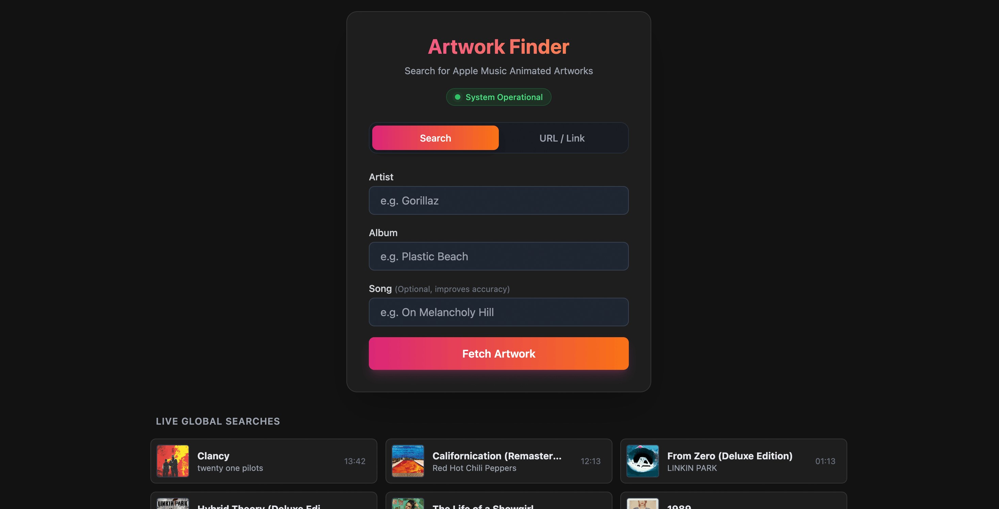

# [](https://artwork.m8tec.top) Apple Music Animated Artworks

[](https://artwork.m8tec.top)
[](https://github.com/m8tec/apple-music-animated-artworks/actions)

<div align="center">



A lightweight tool to fetch and display Apple Music’s animated album covers (HLS/m3u8). Supports both square and tall cover variants, as well as playlist artworks. Built with .NET 10 and a minimal Tailwind CSS frontend.

<table align="center" style="margin-top: 16px; width: 100%;">
	<tr>
		<td align="center" width="50%"><strong>Square Cover</strong></td>
		<td align="center" width="50%"><strong>Tall Cover</strong></td>
	</tr>
	<tr>
		<td align="center">
			<video src=".github/assets/living_things_artwork_square.mp4" autoplay loop muted playsinline controls style="max-width: 100%; border-radius: 8px;"></video>
		</td>
		<td align="center">
			<video src=".github/assets/plastic_beach_deluxe_version_artwork_tall.mp4" autoplay loop muted playsinline controls style="max-width: 100%; border-radius: 8px;"></video>
		</td>
	</tr>
</table>

**Test it out:** [https://artwork.m8tec.top](https://artwork.m8tec.top)

</div>

## What it does
- Search: Accepts artist and album names, or Apple Music URLs, to find the corresponding animated artwork.
- Scraping: Pulls the .m3u8 stream URLs directly from Apple Music.
- Download: Allows in-browser preview and download of the animated covers.
- Multiple Variants: Supports both the standard square cover and the taller variant used for lock screen & expanded artwork views.
- API: Provides a simple REST API for programmatic access to the artwork data.
- Cache: Saves results in local cache files. It only hits Apple's servers once per album.
- Web Player: Simple UI using hls.js to play the animated covers in any browser (not just Safari).

## Tech Stack
- Backend: .NET 10 (Minimal APIs, HttpClient, Regex for parsing)
- Frontend: Plain JS, Tailwind CSS, Hls.js
- Storage: Simple JSON-based persistence (In-memory dictionary + file flush)

## Getting Started

### Run with Docker
```bash
git clone https://github.com/m8tec/apple-music-animated-artworks.git
cd apple-music-animated-artworks
docker compose up -d
```

### Build locally with Docker
```bash
git clone https://github.com/m8tec/apple-music-animated-artworks.git
cd apple-music-animated-artworks
docker compose -f compose.yaml -f compose.dev.yaml up -d --build
```

### Build locally without Docker (.NET 10 required)
```bash
git clone https://github.com/m8tec/apple-music-animated-artworks.git
cd apple-music-animated-artworks
dotnet run
```

## API Reference

Base URL: https://artwork.m8tec.top

**Get Artwork by Details**

```GET /api/v1/artwork/search?artist=Linkin+Park&album=Living+Things```

**Get Artwork by URL**

```GET /api/v1/artwork/url?url=https://music.apple.com/us/album/...```

**Get Global History**

```GET /api/v1/artwork/history```

## Caching Strategy
This project is designed to be "Apple-friendly" to avoid rate limits:
1. **Fuzzy Matching:** The cache uses normalized two-way substring matching. Searching for base albums automatically resolves cached "Deluxe" or "Remastered" editions.
2. Negative Artwork Caching: Albums that are confirmed to have no animated artwork are cached as NONE to prevent repeated futile scraping.
3. Negative Search Caching: If a search query returns no matches, that result is cached to avoid repeated searches for the same non-existent album.

## Legal Disclaimer
This project is for educational purposes only. It uses web scraping techniques to retrieve publicly available metadata. Please respect Apple Music's Terms of Service and use this tool responsibly.